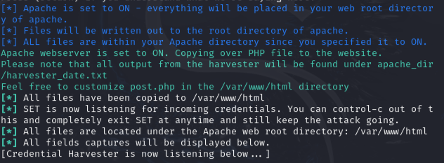
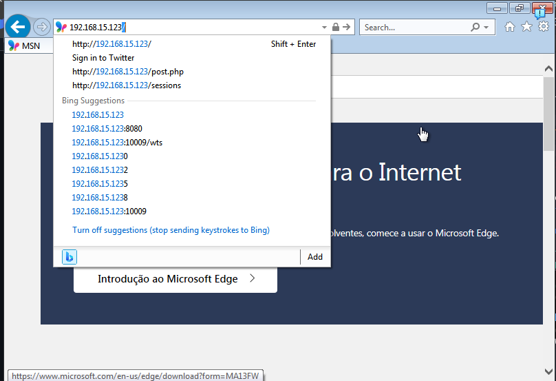
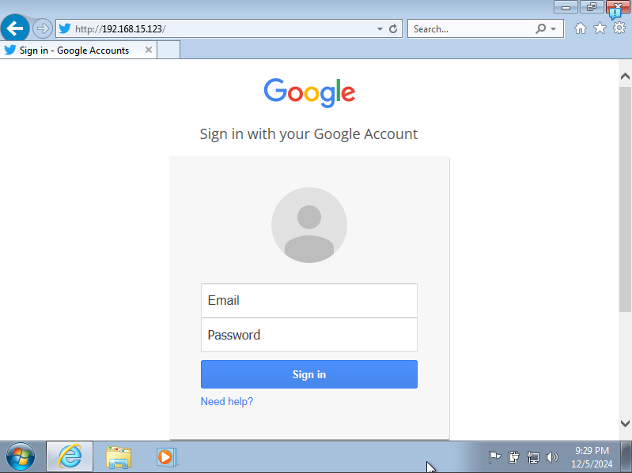
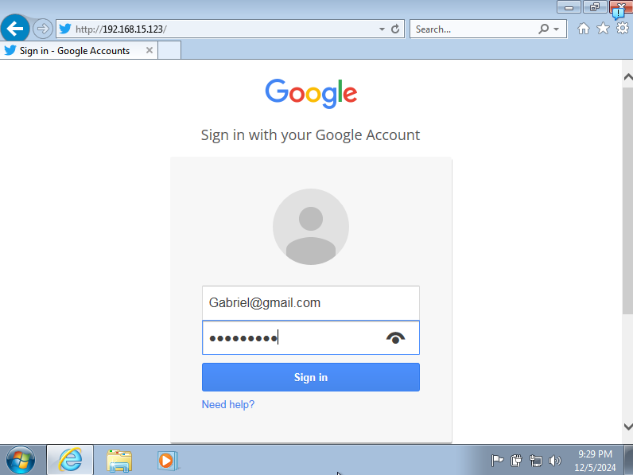
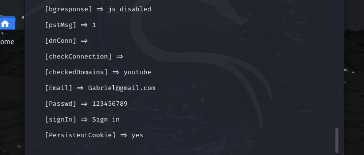

# Phishing para captura de senhas do Google

### Ferramentas

- Kali Linux
- Setoolkit

### Configurando o Phishing no Kali Linux

- Acesso root: ``` sudo su ```
- Iniciando o setoolkit: ``` setoolkit ```
- Tipo de ataque: ``` Social-Engineering Attacks ```
- Vetor de ataque: ``` Web Site Attack Vectors ```
- Método de ataque: ```Credential Harvester Attack Method ```
- Método de ataque: ``` Web Templates ```
- IP para Rebecer informação: ```[192.168.15.123]```
- Template Selecionado: ``` Google ```
  
- Nesta ataque resolvi utilizar o servidor apache para subir o web template, dessa maneira mesmo se pressionar Ctrl + C para sair, o ataque continua rodando.
  


## Visão da vítima
  
  - Eu decidir usar uma das VM's criada no inicio do curso para usar como vítima. ```WINDOWNS 7```.
  
  

  - Ao inserir o IP do atacante a Vítima foi redirecionada para o site abaixo.

  

  - A vitima preencher com as informações para realizar o log-in.

  
  

## Resutados

- Ao final, na tela do atacante é apresentado o Email e senha inseridos pela vítima.


